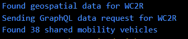
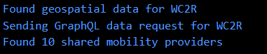

# 👷 `WIP Shared-Mobility Data Tool`

API Endpoint: ``https://flow-api.fluctuo.com/v1``

API Docs: ``https://flow.fluctuo.com/docs``

API Limitations:
| Features         | Free (1 Month Trial) | Pro                 |
| ---------------- | -------------------- | ------------------- |
| Rate Limit       | 10/rps               | None                |
| Monthly Requests | 50,000               | €0.80-€0.60 per 10k |
| Basic GraphQL    | ✅                  | ❌                 |
| Advanced GraphQL | ✅                  | ✅                 |

Current Issues:
- Tool needs to be compiled to be used with different locations

TODO:
- Add more countries for geospatial data
- Add parser for new countries
- Make the tool usable via CLI

